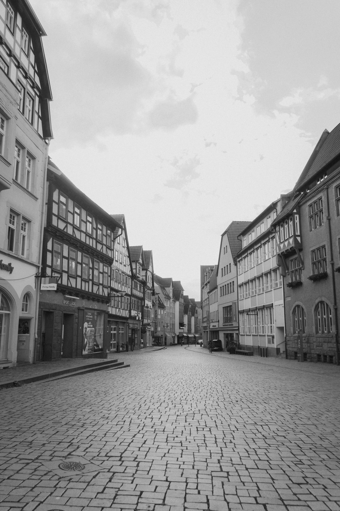
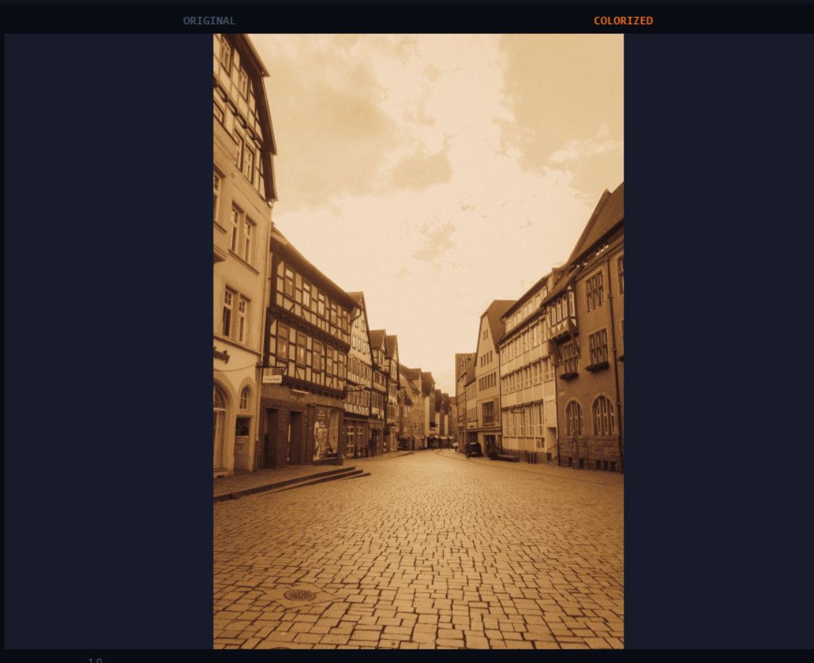

# DL Image Processing Project

## 📌 Overview
This project is based on Deep Learning for image processing. It converts grayscale images into colorized outputs.

## 🧠 Technology Used
- Python
- OpenCV
- Deep Learning Model

## 🖼️ Input vs Output

### Original Image

### Colorized Output

## 🚀 How to Run
1. Install dependencies
2. Run the Python file:
   python main.py

## 📂 Project Structure
- input.jpg
- output.jpg
- main.py

## 🎯 Result
The model successfully converts black and white images into color images.